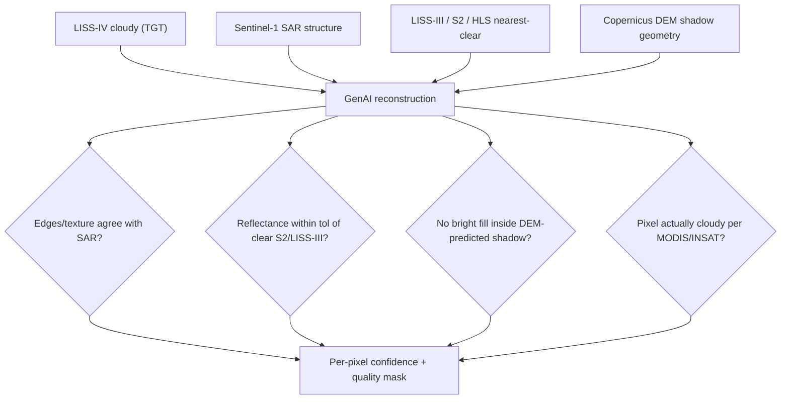
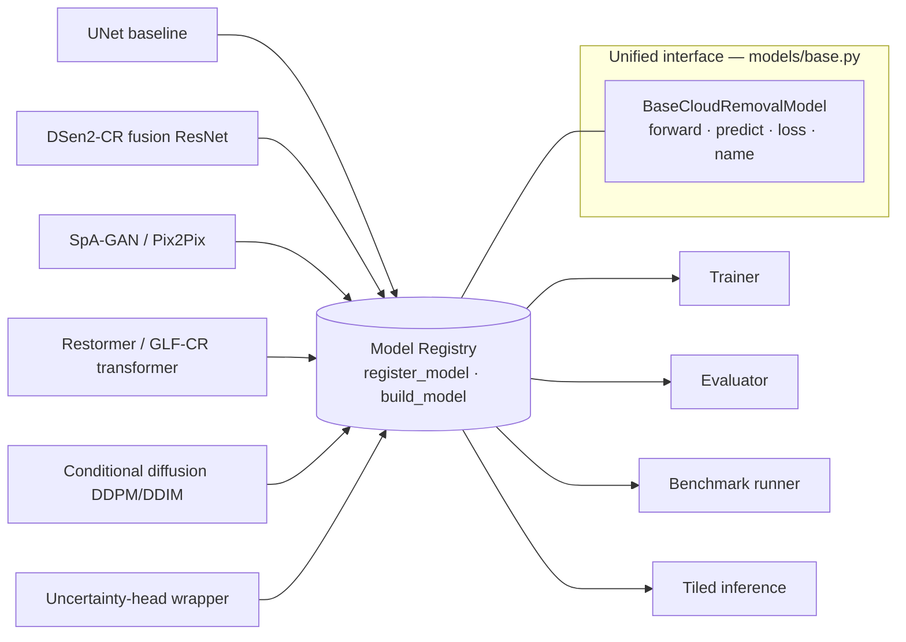
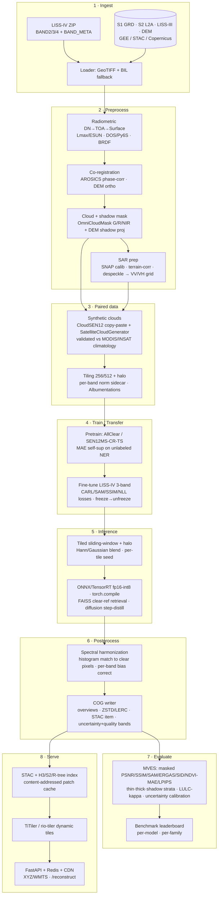
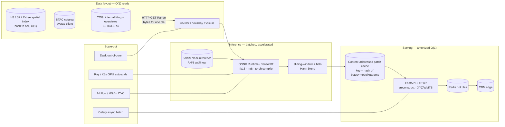

# ARCHITECTURE — Generative-AI Cloud Removal & Reconstruction for LISS-IV (BAH 2026 PS2)

**Project codename:** `cloudremoval` · **Target sensor:** Resourcesat-2/2A **LISS-IV** (5.8 m, 3-band G/R/NIR, 10-bit) · **Region:** North-East India (NER) · **Owner:** Chief Architect synthesis of `research/01–06`.

This is the master technical document. It defines *what we build and why*. The companion documents are [`docs/COMPARATIVE_ASSESSMENT.md`](docs/COMPARATIVE_ASSESSMENT.md) (the required comparative-assessment deliverable, 30+ methods scored) and [`docs/BUILD_PLAN.md`](docs/BUILD_PLAN.md) (the precise interface/work contract that parallel implementation agents follow). Read those two before writing any code.

---

## 1. Executive Summary, Problem Framing, Design Goals

### 1.1 The problem in one paragraph
Persistent cloud cover over NER (≈90–92% mean cloud in the Jul–Aug monsoon peak; usable clear LISS-IV scenes concentrated in a narrow Nov–Mar window) renders high-value 5.8 m LISS-IV optical imagery unusable for ~4 months/year. LISS-IV is uniquely hard: **only 3 VNIR bands (Green 0.52–0.59, Red 0.62–0.68, NIR 0.77–0.86 µm) — no blue, no SWIR, no cirrus band**, 10-bit DN delivered as per-band GeoTIFF with `BAND_META.txt`. Standard cloud masks (Fmask, s2cloudless, Sen2Cor) cannot run unmodified, and **no public LISS-IV cloud-removal benchmark exists.** We must therefore (a) manufacture training data, (b) borrow signal from many other satellites, and (c) build a model-agnostic GenAI framework that lets us run the *comparative assessment of GenAI architectures* the problem statement explicitly demands.

### 1.2 What we deliver (mapped to the problem statement)
| PS2 expected outcome | Our delivery |
|---|---|
| Automated cloud-free reconstruction of LISS-IV | End-to-end CLI pipeline `download→preprocess→simulate→train→eval→benchmark→infer→serve` |
| Preserve spatial structure & spectral consistency | SAR + temporal + DEM conditioning; CARL/spectral/SAM losses; mean-reverting & uncertainty-aware models; masked spectral evaluation |
| Analysis-ready products | COG outputs + STAC metadata + per-pixel uncertainty + quality mask; NDVI verified |
| Quantitative + qualitative evaluation | MVES metric suite (masked PSNR/SSIM/SAM/ERGAS/SID/NDVI-MAE/LPIPS) + LULC-κ downstream + qualitative pack + benchmark leaderboard runner |
| Scalable / operational workflow | COG + STAC + H3/R-tree index + TiTiler + FastAPI + Redis/CDN + ONNX/TensorRT + FAISS; Docker/Ray/Dask |
| **Comparative assessment of GenAI architectures** | One `BaseCloudRemovalModel` interface + a model registry hosting **6 families** (UNet baseline, DSen2-CR fusion, SpA-GAN, Restormer/GLF-CR transformer, conditional diffusion, uncertainty head) benchmarked head-to-head on identical data/metrics |

### 1.3 Design goals
1. **Model-agnostic comparability.** Every architecture plugs into one interface and is trained/evaluated through one harness on identical splits. The comparison *is* a deliverable.
2. **Spectral fidelity over raw PSNR.** Reflectance correctness drives NDVI/LULC. We optimize and report SAM/ERGAS/SID/NDVI-MAE and we prefer mean-reverting / uncertainty-aware models that resist spectral hallucination.
3. **Multi-satellite cross-verification & gap-filling.** No single source suffices. Sentinel-1 SAR (structure under cloud), Sentinel-2 (spectral proxy/pretrain), LISS-III/Landsat/HLS (temporal reference), MODIS/INSAT (cloud climatology), Copernicus DEM GLO-30 (shadow geometry).
4. **Runs everywhere.** Must execute on a **CPU-only box with synthetic data and tiny configs** (CI, laptops, the jury's machine) and **scale to GPU + real Bhoonidhi data** by config switch only.
5. **O(1)-per-tile serving.** True whole-scene O(1) is impossible; we achieve O(1)-per-tile reads (COG range requests), O(1)-ish spatial lookup (H3/R-tree), amortized-O(1) serving (content-addressed cache + Redis/CDN), and sublinear nearest-clear-reference retrieval (FAISS).

### 1.4 Non-goals
- We do **not** ship a production atmospheric-correction engine; DOS + optional Py6S is sufficient for the prototype (surface reflectance is approximate).
- We do **not** require live Bhoonidhi/Copernicus credentials to run, build, test, or demo — synthetic data must carry the full pipeline.
- We do **not** redistribute third-party pretrained weights with restrictive/unverified licenses inside the repo; we provide *adapters* that load them at runtime when the user supplies them, and we always have a from-scratch fallback.
- We are **not** building a generic EO platform; scope is cloud removal + reconstruction + its evaluation/serving.

---

## 2. Multi-Satellite Data Strategy

### 2.1 Roles of each source (target / auxiliary / temporal / cross-verify)
LISS-IV is the **only** reconstruction target (TGT). Everything else is evidence that closes what LISS-IV cannot see.

| Source | Role | What it contributes | Access |
|---|---|---|---|
| **LISS-IV** (Resourcesat-2/2A) | **TGT** | The 5.8 m 3-band scene to reconstruct | Bhoonidhi (free, open ≤5 m) |
| **Sentinel-1 GRD** (C-band VV/VH) | **AUX** | Cloud-penetrating *structure* under thick cloud — the #1 thick-cloud signal | Copernicus / GEE / MPC |
| **Sentinel-2 L2A** {B3,B4,B8} | **XV / PROXY** | Spectral proxy (band-matched), pretraining domain, clear-sky reference verifier | Copernicus / GEE / MPC / AWS |
| **LISS-III / AWiFS** | **TMP / XV** | Same-platform spectral siblings (identical G/R/NIR passbands) **+ SWIR teacher** band LISS-IV lacks | Bhoonidhi |
| **Landsat-8/9 / HLS** | **TMP / XV** | Calibrated temporal stack; cirrus/QA aids masking on the proxy side | EE / GEE / MPC |
| **MODIS / INSAT-3D/3DR / ERA5** | **XV** | Cloud climatology (when is NER clear), per-scene cloud fraction, acquisition planning | LP DAAC / MOSDAC / CDS |
| **Copernicus DEM GLO-30 / CartoDEM** | **AUX** | Cloud-shadow vs terrain-shadow geometry; slope/aspect conditioning; ortho/co-reg frame | GEE / MPC / Bhoonidhi |
| **PlanetScope** (optional) | **AUX / TMP** | 3–5 m near-daily gap-fill where available | Commercial / NICFI |

### 2.2 Band mapping (the linchpin for transfer learning)
LISS-IV's three bands map almost 1:1 onto Sentinel-2 and the Resourcesat siblings. This is what makes transfer from S2-based benchmarks (SEN12MS-CR etc.) viable.

| LISS-IV | λ (µm) | Sentinel-2 | Landsat-8/9 | LISS-III/AWiFS | Note |
|---|---|---|---|---|---|
| B2 Green | 0.52–0.59 | **B3** (560 nm, 10 m) | B3 (0.53–0.59) | Green (0.52–0.59) | near-identical |
| B3 Red | 0.62–0.68 | **B4** (665 nm, 10 m) | B4 (0.64–0.67) | Red (0.62–0.68) | near-identical |
| B4 NIR | 0.77–0.86 | **B8** (833 nm, 106 nm wide, 10 m) — or B8A (865 nm, 21 nm) | B5 (0.85–0.88) | NIR (0.77–0.86) | LISS-IV NIR is **wide**; B8 closer by bandwidth, B8A by center → apply **SBAF** + histogram match |
| *(none)* | — | B11/B12 SWIR; B10 cirrus | SWIR/Cirrus | **SWIR 1.55–1.70** | LISS-IV lacks SWIR; use LISS-III/AWiFS or S2 SWIR only on the *proxy* side as masking/teacher signal |

**Practical surrogate:** to build a LISS-IV stand-in from Sentinel-2 use **S2 {B3,B4,B8}**, resample 10 m → 5.8 m, then SBAF/histogram-match (especially NIR). Calibrate LISS-IV DN → TOA reflectance via `Lmax` (B2≈53.0, B3≈47.0, B4≈31.5 mW·cm⁻²·sr⁻¹·µm⁻¹), ESUN, sun-elevation and Earth–Sun distance before any model sees it.

### 2.3 Synthetic-cloud + transfer-learning plan (because no LISS-IV benchmark exists)
The training-data problem is solved by a **three-pronged data engine**:

1. **Synthetic cloud injection (paired-pair generator).** Take clear LISS-IV (and clear S2 surrogate) scenes as ground truth; paste physically-plausible clouds + shadows to create perfect (cloudy, clear) pairs. Prefer **copy-paste of real cloud alpha-mattes** (sourced from **CloudSEN12+ / KappaSet**, validated against **MODIS/INSAT NER climatology** so opacity/coverage distributions are regionally realistic) over pure Perlin (which transfers worse). Generate **thin (haze, spectrally recoverable)** and **thick (opaque, inpainting/SAR-driven)** classes separately to match stratified evaluation. Library: `SatelliteCloudGenerator` + custom copy-paste.
2. **Transfer learning.** Pretrain on **AllClear** (largest multimodal/temporal), **SEN12MS-CR** (single-pass SAR-optical), **SEN12MS-CR-TS** (temporal), then **domain-adapt to LISS-IV** (3-band, SBAF-aligned, MAE self-supervised pretext on unlabeled NER tiles). Mask labels from **CloudSEN12+** (CC0).
3. **Cross-sensor fusion & domain adaptation LISS-IV↔S2.** Histogram matching / SBAF + (optionally) CycleGAN-style alignment to bridge the residual spectral gap so S2-trained weights generalize to scarce LISS-IV.

### 2.4 Cross-verification & gap-filling logic
Reconstruction is under-constrained for a 3-band cloudy scene, so we stack independent evidence and **cross-check the output**:


Disagreement on any check lowers that pixel's confidence (propagated alongside the model's own aleatoric uncertainty head). This *verification loop* is what turns a research demo into a credible ISRO product and is itself the "many satellites for cross-verification" requirement made operational.

### 2.5 Why ≥30 methods / many satellites
The problem statement asks for a **comparative assessment of different GenAI architectures**, and the user demands cross-source robustness. We therefore catalogue and score **30+ methods across 6 families** (see `docs/COMPARATIVE_ASSESSMENT.md`) and ingest **~30 sensors/platforms + ~18 benchmark datasets** (see `research/04`). The breadth is not academic completeness for its own sake: each satellite answers a specific failure mode of a 3-band cloudy sensor (SAR→thick cloud; S2→spectral proxy; LISS-III→SWIR teacher; MODIS/INSAT→climatology; DEM→shadow), and each model family exposes a different point on the fidelity/speed/data-efficiency frontier that the jury wants compared.

---

## 3. The Unified GenAI Framework (model-agnostic)

### 3.1 Core idea: one interface, many architectures
All models implement a single abstract class `BaseCloudRemovalModel` and self-register via `@register_model("name")`. The trainer, evaluator, benchmark runner, and inference engine are written **only against the interface and a standard `SAMPLE` dict** — they never import a concrete model. This is what makes the comparative assessment fair (identical data, losses-API, metrics, tiling) and lets builders work in parallel without collisions.



### 3.2 The standard SAMPLE (every model sees the same dict)
A dataset `__getitem__` returns a dict with all conditioning channels; a model uses whatever subset it needs and ignores the rest. Keys (tensors are float32, channel-first, reflectance-normalized):

`optical_cloudy[C,H,W]` (C=3 G/R/NIR, the input) · `optical_clear[C,H,W]` (target, may be None at inference) · `cloud_mask[1,H,W]` (1=cloud) · `shadow_mask[1,H,W]` · `sar[2,H,W]` (VV,VH; zeros if absent) · `dem[1,H,W]` (normalized elevation/slope; zeros if absent) · `temporal_refs[T,C,H,W]` (nearest-clear refs; T may be 0) · `meta` (dict: scene id, date, sun-elevation, CRS, transform, per-band norm stats, thin/thick label).

### 3.3 The six chosen families and their fusion design
Selected to cover the frontier *and* satisfy "≥1 of each family + a baseline" (full justification in `docs/COMPARATIVE_ASSESSMENT.md`):

1. **UNet baseline** (`unet`) — time-tested encoder-decoder, optical-only, L1+SSIM. The control that quantifies how much GenAI adds and exposes hallucination by contrast. Always runs on CPU.
2. **DSen2-CR-style SAR-optical fusion ResNet** (`dsen2cr`) — ~16 residual blocks, **early channel-concat of SAR (VV/VH) + cloudy optical**, long global skip (residual correction), **CARL loss** (cloud-mask-weighted L1). The robust, non-adversarial thick-cloud workhorse. This is the primary engine for persistent NER cloud.
3. **SpA-GAN / Pix2Pix-style GAN** (`spagan`) — spatial-attention generator + PatchGAN discriminator, adversarial + L1 + attention loss. Supplies fine 5.8 m texture/sharpness that L1 cores lack; thin-cloud specialist; MIT-licensed reference exists.
4. **Restormer / GLF-CR-style transformer** (`restormer`) — channel-attention (MDTA) restoration core, optionally with **GLF-CR global-local SAR fusion via cross-attention + dynamic speckle filtering** and **Align-CR deformable alignment** for imperfect LISS-IV↔S1 co-registration. Best long-range structure reconstruction.
5. **Conditional diffusion** (`diffusion`) — DDPM training / **DDIM** few-step sampling, SR3/Palette concatenation conditioning on the cloudy image, **optional SAR conditioning channels**, mean-reverting option (EMRDM-style: start sampling from cloudy radiometry, not noise, for spectral fidelity), consistency-distillation hook for fast thick-cloud inference (CM-CR pattern). Best generative prior for total occlusion.
6. **Uncertainty head** (`uncertainty`) — a wrapper that adds a per-pixel aleatoric variance output (NLL loss) to *any* backbone (UnCRtainTS-style). Produces the confidence map fused with the §2.4 cross-verification — the operational differentiator.

> **Naming convention.** The registry key is the short name shown above (`dsen2cr`, `spagan`, `restormer`) — use those with the CLI, config `model.name`, and serving API; the source file may use the longer descriptive name (`dsen2cr_fusion.py`, `gan_spagan.py`, `transformer_restormer.py`).

**Cross-cutting fusion mechanics shared across models:**
- **SAR conditioning:** early concat (DSen2-CR) → feature-level → cross-attention (GLF-CR). SAR guides *structure only*, never dictates radiometry directly. Despeckle (Refined Lee) before fusion or use dynamic-filter speckle suppression.
- **Temporal conditioning:** `temporal_refs` consumed by temporal-attention (L-TAE/UnCRtainTS) or as a composite-then-refine prior; nearest-clear preferred to avoid land-cover drift.
- **DEM-guided shadow handling:** project cloud mask along solar azimuth/elevation at candidate heights, intersect with terrain → predicted shadow mask fed as a channel and used to forbid spurious bright fills in shadow.
- **Uncertainty head:** optional on all of the above; default ON for the operational config.

---

## 4. End-to-End Pipeline



Each stage is a CLI subcommand and a package module (§8), so any stage runs standalone and is independently testable. With synthetic data, stages 1–2 degrade gracefully to "generate a fake LISS-IV-like tile" so the whole chain runs CPU-only with no network.

---

## 5. Evaluation & Comparative Framework

### 5.1 Metric suite (spectral-first)
The deliverable-defining metrics are **spectral**, not pixel. We implement, with identical signatures, a Minimum Viable Evaluation Suite (MVES) in tiers:

- **Tier 0 (gate any claim):** masked + whole-image **PSNR, SSIM (per-band), RMSE/MAE**; **SAM**, **ERGAS** (the spectral gate); **NDVI-MAE + ΔNDVI** map; everything stratified **thin vs thick** and **cloud vs shadow**.
- **Tier 1 (strong submission):** per-band Pearson correlation + per-band reflectance bias; **LULC consistency (Cohen's κ)** with a fixed RF classifier on real-vs-reconstructed; qualitative pack.
- **Tier 2 (competitive edge):** FID/KID/LPIPS on RGB renders (relative, fixed-N); **SID**; uncertainty **ECE/coverage**; change-detection false-change rate.

### 5.2 Masked vs whole-image (the non-negotiable rule)
Most of a scene is already clear, so whole-image metrics are inflated. **Every metric is reported in three columns: whole / cloud-region-only / shadow-region-only**, with the cloud-region column being the real score. Thin and thick are separate difficulties and reported separately.

### 5.3 Downstream-task validation (proves "analysis-ready")
- **LULC κ:** apply a frozen classifier to real-clear vs reconstructed; high κ ⇒ class-discriminating spectra preserved.
- **NDVI error maps:** the most reviewer-legible "is it usable" figure.
- **Change-detection consistency:** no spurious change injected into former cloud regions.

### 5.4 Qualitative protocol
Side-by-side triptychs (cloudy | reconstruction | reference/SAR, fixed band combo & stretch); absolute-error and ΔNDVI heatmaps with shared colorbars; spectral-profile/transect plots (predicted vs true 3-band signature); optional blinded MOS panel; BRISQUE/NIQE only as relative no-reference sanity where no ground truth exists.

### 5.5 Benchmark runner → leaderboard
`cloudremoval benchmark` iterates every registered model over a fixed eval split with identical tiling/seeds, computes the full MVES, and emits a **leaderboard** (CSV/Markdown/HTML) ranking models per-metric and per-family, plus compute/inference-speed columns. This *is* the comparative-assessment artifact for the jury; it is reproducible per-commit in CI on the synthetic set.

---

## 6. Scalable / O(1) Serving Architecture

True O(1) for whole-scene generation is impossible; we engineer **O(1)-per-tile reads, O(1)-ish lookup, amortized-O(1) serving, and sublinear retrieval.**



**Mechanisms:** COG internal tiling + overviews → an HTTP range request fetches only one tile's bytes (hundreds of KB, not a 50 GB scene). STAC + H3/S2/R-tree give O(1)-ish "which tile/cell" lookup and natural cache keys. The content-addressed patch cache means identical (tile, model, params) is never recomputed (cache hit = O(1)). ONNX/TensorRT fp16-int8 + `torch.compile` + batched tiling keep the GPU saturated; diffusion uses step distillation / consistency models (50→1–4 steps). FAISS ANN-retrieves the nearest historical clear LISS-IV/S2 analog to condition the fill in effectively O(1) at our scale. The entire stack runs identically **on-prem air-gapped** (MinIO for S3-compatible COG range reads + local TiTiler + bundled ONNX engines) — important for ISRO.

---

## 7. Tech Stack

| Layer | Libraries | Why |
|---|---|---|
| Core DL | PyTorch (+ optional Lightning), `torch.compile` | Ecosystem, ONNX export, problem-statement default |
| Config | **pydantic v2** + YAML | Typed, validated configs; one schema CPU↔GPU |
| Geospatial I/O | GDAL, `rasterio`, `rioxarray`/`xarray`, `geopandas`, `pyproj` | LISS-IV GeoTIFF/BIL, reprojection, windows |
| SAR | ESA SNAP, `pyroSAR`/`sarsen` | S1 GRD calib/terrain-corr/despeckle |
| Co-registration | **`arosics`**, `scikit-image`/OpenCV phase-corr | Sub-pixel LISS-IV↔S1/S2 alignment |
| Cloud/shadow mask | **`omnicloudmask`** (G/R/NIR @5.8 m), `s2cloudless`/`python-fmask` (proxy), DEM shadow projection | Only OCM runs on 3-band LISS-IV |
| Synthetic clouds | **`SatelliteCloudGenerator`** + CloudSEN12 copy-paste | Paired ground truth |
| Augmentation | `albumentations`, `opencv-python`, `scikit-image` | Geometric aug (spectral aug minimal) |
| Datasets/access | `pystac-client`, `odc-stac`/`stackstac`, GEE (optional), `landsatxplore` | STAC lazy load, server-side compositing |
| Metrics | `torchmetrics`, `sewar` (SAM/ERGAS), `pytorch-msssim`, `piq`/`pyiqa` (LPIPS/NIQE/BRISQUE), `torch-fidelity` (FID/KID), `scikit-learn` (LULC κ), `netcal` (ECE) | Full MVES |
| COG/serve | `rio-cogeo`, **TiTiler**/`rio-tiler`, `pystac`, FastAPI, Redis, CDN | Cloud-native analysis-ready tiles |
| Indexing/retrieval | `h3`, `s2sphere`, `rtree`, **`faiss`** | O(1) lookup + ANN clear-reference |
| Inference accel | **ONNX Runtime**, **TensorRT**, `torch.compile` | fp16/int8, seconds-per-scene |
| Orchestration | Docker, **Ray**/Kubernetes, Dask, Celery, MLflow/W&B, DVC | Repro, scale, out-of-core, tracking |
| Quality | `pytest`, `ruff`, `black`, type hints, structured logging | Standards (§BUILD_PLAN) |

License discipline: prefer MIT/Apache/CC0 sources (SpA-GAN MIT, CloudSEN12 CC0, Prithvi/Clay/DOFA Apache). GPL (DSen2-CR repo) and unverified-license repos are **reimplemented**, not vendored.

---

## 8. Repository Layout (canonical)

This is the single source of truth; `docs/BUILD_PLAN.md` repeats it with per-file ownership.

```
bah2026-ps2/
├── ARCHITECTURE.md
├── README.md
├── pyproject.toml                 # deps, ruff/black/pytest config, entry point `cloudremoval`
├── requirements.txt               # pinned mirror for pip/CI
├── Makefile                       # setup / lint / test / train-smoke / serve / docker
├── Dockerfile  docker-compose.yml # api + redis (+ optional ray/worker) services
├── .gitignore  .dockerignore  .pre-commit-config.yaml
├── .github/workflows/ci.yml       # ruff+black+pytest+CPU smoke train+benchmark on synthetic
├── configs/                       # pydantic-validated YAML
│   ├── base.yaml  cpu_smoke.yaml  gpu_full.yaml
│   ├── data/{synthetic,lissiv_ner,sen12mscr}.yaml
│   ├── model/{unet,dsen2cr,spagan,restormer,diffusion,uncertainty}.yaml
│   └── serve/serve.yaml
├── src/cloudremoval/
│   ├── __init__.py  config.py  cli.py
│   ├── data/
│   │   ├── __init__.py  preprocess.py  coregister.py  masking.py
│   │   ├── synthetic_clouds.py  datasets.py  transforms.py  cog_tiling.py
│   │   └── sources/{__init__,bhoonidhi,gee,stac,sentinel,dem}.py
│   ├── models/
│   │   ├── __init__.py  base.py  registry.py  losses.py
│   │   ├── unet.py  dsen2cr_fusion.py  gan_spagan.py
│   │   ├── transformer_restormer.py  diffusion.py  uncertainty.py
│   ├── training/{__init__,trainer,lightning_module,callbacks}.py
│   ├── evaluation/{__init__,metrics,evaluator,benchmark,report}.py
│   ├── inference/{__init__,tiled,blending,postprocess,cog_writer}.py
│   ├── serving/{__init__,app,tiles,schemas}.py
│   └── utils/{__init__,geo,io,logging,seed}.py
├── scripts/                       # thin CLI wrappers (download/preprocess/simulate/train/eval/benchmark/infer/serve_*.py)
├── tests/                         # unit + integration (CPU, synthetic) + conftest fixtures
├── docs/{COMPARATIVE_ASSESSMENT,BUILD_PLAN,DATA_CARD,MODEL_CARD,API}.md
└── notebooks/                     # exploratory (not in CI)
```

---

## 9. Risks, Mitigations, Roadmap

### 9.1 Top risks → mitigations
| Risk | Mitigation |
|---|---|
| No LISS-IV pairs; severe scarcity | Synthetic clouds + SEN12MS-CR/AllClear transfer + MAE self-sup + SAR fusion |
| **Spectral hallucination** (wrong reflectance → broken NDVI) | Mean-reverting diffusion (EMRDM), CARL/SAM losses, histogram-match to clear pixels, **always report SAM/ERGAS/NDVI**, uncertainty flagging |
| 3 bands, no blue/SWIR/cirrus → masks fail | OmniCloudMask on G/R/NIR + DEM shadow projection + LISS-III/AWiFS SWIR teacher; SAR/temporal cues for cirrus |
| Snow ≈ cloud in 3 bands (Sikkim/Arunachal) | DEM/elevation prior + temporal persistence (snow static, cloud moves) |
| LISS-IV↔S1 co-registration over relief, ±26° steering | Ortho products + AROSICS sub-pixel + Align-CR deformable feature alignment; mask-weighted losses tolerate residual misregistration |
| SAR speckle leakage | Despeckle (Refined Lee) + GLF-CR dynamic-filter speckle suppression; SAR = structure not radiometry |
| RGB-pretrained latents/weights mis-map NIR | First-conv/VAE surgery initialized from G/R/NIR channels; or DOFA wavelength hypernetwork; never blind-load |
| Diffusion inference too slow at scene scale | DDIM/consistency distillation + fp16/TensorRT + latent/condition caching + tiled batching |
| GAN instability | Train L1/CARL core first, add adversarial head last (curriculum); spectral-norm/TTUR; prefer non-adversarial cores |
| Metric-transfer fallacy (S2 numbers ≠ LISS-IV) | Re-benchmark on our NER set; report relative-to-baseline, not absolute |
| License/IP | Reimplement GPL/unverified-license methods; vendor only MIT/Apache/CC0; runtime adapters for external weights |

### 9.2 Phased roadmap (MVP → full)
- **Phase 0 — Scaffold (week 1):** repo skeleton, `BaseCloudRemovalModel`, registry, config schema, synthetic data generator, MVES Tier-0, UNet baseline. **Everything runs CPU-only on synthetic data, green CI.** This is the demonstrable MVP.
- **Phase 1 — Core models & fusion (weeks 2–3):** DSen2-CR fusion ResNet (CARL), SpA-GAN, OmniCloudMask masking, real-data loaders (Bhoonidhi/STAC), co-registration, SAR prep. Benchmark leaderboard live.
- **Phase 2 — Advanced GenAI (weeks 3–5):** Restormer/GLF-CR transformer with SAR cross-attention + Align-CR alignment, conditional diffusion (DDPM/DDIM, mean-reverting, SAR-conditioned), uncertainty head, transfer-learning from SEN12MS-CR/AllClear, temporal conditioning.
- **Phase 3 — Scale & serve (weeks 5–6):** COG/STAC/H3 index, TiTiler+FastAPI+Redis/CDN, ONNX/TensorRT export, FAISS retrieval, consistency-distilled fast diffusion, Ray/Dask/Celery, MLflow/DVC, full qualitative + downstream LULC evaluation, comparative-assessment report finalized.

### 9.3 Constrained-env ↔ scale story
The **same code** runs in both regimes; only the config (`cpu_smoke.yaml` vs `gpu_full.yaml`) changes. CPU/synthetic: tiny tiles (64–128 px), 1–2 residual blocks, 5 DDIM steps, synthetic LISS-IV-like tensors, no network, finishes in seconds — used for CI, laptops, and the jury demo. GPU/real: full 256/512 tiles, full-depth models, real Bhoonidhi + Copernicus + DEM ingestion, TensorRT serving, Ray autoscaling. Builders must guarantee every model and stage is exercised by the CPU-smoke path so nothing is GPU-only.

---

## 10. Summary
We synthesize the research into a **model-agnostic GenAI cloud-removal framework** that (1) solves LISS-IV's data scarcity with synthetic clouds + multi-satellite transfer learning, (2) fuses SAR/temporal/DEM evidence with explicit cross-verification, (3) hosts six GenAI families behind one interface for the required comparative assessment, (4) evaluates spectral fidelity first with masked/stratified metrics + downstream LULC, and (5) serves analysis-ready COGs through an O(1)-per-tile cloud-native stack that also runs air-gapped on-prem. The design deliberately degrades to a CPU-only synthetic-data MVP and scales by config to GPU + real Bhoonidhi data. Proceed to `docs/COMPARATIVE_ASSESSMENT.md` and `docs/BUILD_PLAN.md`.
