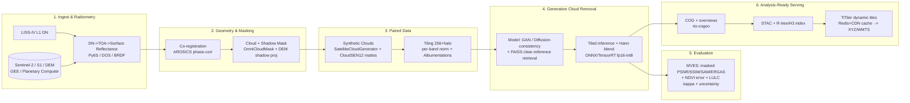

# Evaluation Metrics, Geospatial Preprocessing & Scalable Deployment for LISS-IV Cloud Removal

**BAH 2026 PS2 — Generative AI-Based Cloud Removal & Reconstruction for LISS-IV (5.8 m, Green/Red/NIR, Resourcesat-2/2A).** Focus region: NER India (persistently cloudy). This document covers (A) evaluation metrics, (B) the geospatial preprocessing pipeline, and (C) scalable / "O(1)" deployment. Sourcing is marked **[verified]** (web-checked this session), **[memory]** (internal knowledge, high confidence), or **[unverified]** (plausible, not checked — treat with care).

> **Critical caveat for LISS-IV:** there is **no native cloud-free/cloudy paired ground truth** at 5.8 m. Most published metrics assume a clean reference exists (SEN12MS-CR style). Our reference will be **synthetic clouds over clear LISS-IV scenes** (paired) plus **cross-sensor proxies** (co-registered Sentinel-2 surface reflectance resampled to 5.8 m). Every metric below must be read through "do we actually have ground truth here?" Cloud-region-only masked evaluation is therefore non-negotiable.

---

## (A) Evaluation Metrics

### A.1 Reconstruction / pixel fidelity

These compare reconstructed image `Î` to reference `I` over `N` pixels (or only the masked cloud region `M`).

| Metric | Formula (core) | Interpretation | When it MISLEADS |
|---|---|---|---|
| **RMSE** | `sqrt( mean( (Î−I)² ) )` | Pixel error in reflectance units; sensitive to large errors. | Scale-dependent; dominated by bright pixels; says nothing about structure or spectra. |
| **MAE** | `mean(|Î−I|)` | Average absolute error; robust to outliers vs RMSE. | A blurry mean-prediction can score well; ignores texture. |
| **PSNR** | `10·log10(MAX² / MSE)` (dB) | Higher = less distortion. MAX = data range (e.g. 1.0 if normalized, or DN max). | **Generative models routinely "win" PSNR by over-smoothing** — high PSNR ≠ realistic texture. Per-band MAX matters; report the MAX used. |
| **SSIM** | `((2μxμy+c1)(2σxy+c2)) / ((μx²+μy²+c1)(σx²+σy²+c2))` | Structure/luminance/contrast similarity in [−1,1] (≈1 good). Windowed (e.g. 11×11). | Local-window only; a globally wrong tint can still score high; weak on fine high-frequency detail. |
| **MS-SSIM** | SSIM across a Gaussian pyramid (multiple scales), product of scale scores | Better correlates with perception of detail at multiple resolutions than single-scale SSIM. | Still structure-only; ignores absolute spectral values. |

**[verified]** PSNR/SSIM/MAE/SAM are the central, near-universal quartet in 2024–2025 cloud-removal papers (U-TILISE, SAR-diffusion bridge, SAR-conditioned consistency models). **[memory]** Compute SSIM/MS-SSIM **per band** then average — RGB-collapsed SSIM hides NIR errors, which is the band that drives NDVI.

### A.2 Spectral fidelity — CRITICAL for analysis-ready products

Because LISS-IV products feed NDVI/LULC, **spectral metrics are the deliverable-defining metrics**, not the pixel ones.

| Metric | Formula (core) | Interpretation | When it MISLEADS |
|---|---|---|---|
| **SAM** (Spectral Angle Mapper) | `arccos( (ηI) / (‖Î‖‖I‖) )` per pixel, averaged; degrees | **The headline spectral metric.** Angle between predicted & true spectral vectors → invariant to gain/illumination scaling, captures *spectral shape*. Low = good (often <5°). | Insensitive to overall brightness/magnitude errors (only angle). With **3 bands only** the vector is short, so SAM is coarse — pair with ERGAS/per-band correlation. |
| **ERGAS** | `100·(h/l)·sqrt( (1/B)·Σ_b (RMSE_b² / μ_b²) )` | Global relative dimensionless error, normalized per band by band mean; `h/l` = resolution ratio (1 if same grid). Aggregates per-band relative error. Low = good (<3 often "good"). | Sensitive to band mean `μ_b`; dark bands inflate it; assumes a meaningful resolution ratio. |
| **SID** (Spectral Information Divergence) | `SID = KL(p‖q) + KL(q‖p)`, where `p`,`q` = spectra normalized to probability vectors | Information-theoretic spectral mismatch; more discriminative than SAM for subtle shape change. | Needs non-negative spectra; unstable for near-zero/3-band vectors; less common → harder to compare to literature. |
| **Per-band Pearson correlation** | `corr(Î_b, I_b)` per band | Linear agreement per band; cheap, intuitive; flag any band <~0.9. | Insensitive to bias/gain (r is scale/offset invariant) — high r with wrong absolute reflectance. |
| **Spectral histogram / KL divergence** | `KL(hist(Î_b) ‖ hist(I_b))` per band | Distribution match per band (no spatial alignment needed → good when reference is a *proxy*, not co-registered). | Ignores spatial location; two images with swapped regions match perfectly. |
| **NDVI error / band-ratio preservation** | `NDVI=(NIR−Red)/(NIR+Red)`; report `MAE(NDVI)`, `bias`, error map | **Direct downstream proxy.** LISS-IV NIR+Red present → NDVI computable. ΔNDVI maps show where vegetation analytics would break. | A model can match RGB visually yet shift NIR → large NDVI error invisible to PSNR/SSIM. Always include. |

**[verified]** Spectral-spatial suites for spectral imagery explicitly combine PSNR + SSIM + SAM + spectral relative error (SRE/ERGAS-like); SAM = "spectral reality," SSIM = "spatial texture." **[memory]** Report **per-band reflectance bias** (`mean(Î_b−I_b)`) separately — SAM and correlation both hide systematic bias that wrecks reflectance-based products.

### A.3 Perceptual / distributional metrics

| Metric | What it does | Interpretation | When it MISLEADS |
|---|---|---|---|
| **LPIPS** | Distance between deep features (AlexNet/VGG) of `Î` vs `I` | Aligns with human texture perception; lower = better; good for "does it look real." | **[verified]** Backbones are RGB/ImageNet-pretrained → **domain gap for NIR & satellite**; LPIPS on a 3-band (incl. NIR) raster is only loosely meaningful. Use on RGB-rendered version, report as secondary. |
| **FID** | Fréchet distance between Inception feature *distributions* (set-level) | Realism + diversity of a *set* of outputs; lower = better. | **[verified]** FID "does not necessarily align with human perception in remote sensing / EO." Needs large N (hundreds+); Inception is RGB. Treat as relative, same-N, RGB-render only. |
| **KID** | Kernel (MMD) two-sample test on Inception features | Like FID but **unbiased & stable for small samples** → better when test scenes are few (our case). | Same RGB/domain-gap caveat; still set-level, not per-image. |
| **Perceptual / feature loss** | L2 in VGG feature space, used as a *training loss* | Encourages sharp, texture-rich reconstructions vs blurry L1/L2-only. | A *loss*, not a clean evaluation metric; can hallucinate plausible-but-wrong texture → must be checked against SAM/NDVI. |

**Recommendation:** distributional metrics (FID/KID/LPIPS) are **supporting evidence for realism only**, computed on RGB renders with fixed stretch. Never let them override SAM/ERGAS/NDVI for an analysis-ready claim.

### A.4 Masked: cloud-region-only vs whole-image

This is the single most important methodological point. **[memory]**

- **Whole-image metrics are inflated**: most of a scene is already clear; copying clear pixels through gives near-perfect PSNR even with a terrible cloud fill.
- **Always report a masked variant** computed *only inside the (former) cloud + cloud-shadow mask* `M`: `metric_masked = f(Î[M], I[M])`.
- Report **three columns** for every metric: (1) whole image, (2) cloud region only, (3) cloud-shadow region only. The cloud-region column is the real score.
- For **thin vs thick** clouds, stratify the mask (thin haze recoverable spectrally; thick = pure inpainting/SAR-driven) and report separately — they are different difficulties.

### A.5 Downstream-task metrics (proves "analysis-ready")

- **LULC classification consistency:** train/apply a fixed classifier (e.g. Random Forest, or a frozen CNN) on **real clear** vs **reconstructed**; report per-class accuracy, overall accuracy, and **Cohen's κ** of agreement (real-vs-reconstructed labels). High κ → reconstruction preserves class-discriminating spectra.
- **Change-detection consistency:** run NDVI-diff or a CD method on (clear t1, reconstructed t2) and check no spurious change is injected in former cloud regions (false-change rate).
- **NDVI error maps:** spatial `ΔNDVI` heatmap + histogram inside `M`; this is the most reviewer-legible "is it usable" figure.

### A.6 Uncertainty metrics

- **Predictive variance / ensemble or MC-dropout std:** per-pixel σ map; flags low-confidence (thick-cloud-interior) fills for downstream masking. **[memory]**
- **Calibration:** reliability diagram + **ECE (Expected Calibration Error)**; or for regression, check empirical coverage of predictive intervals (e.g. does the 90% interval contain truth ~90% of the time?). Well-calibrated uncertainty lets users threshold "trust this pixel." **[memory]**

### A.7 Qualitative protocols (the "QUALITATIVE" deliverable)

- **Side-by-side triptychs:** cloudy input | reconstruction | reference/SAR, fixed band combo & stretch.
- **Error heatmaps:** absolute error + ΔNDVI, shared colorbar.
- **Spectral profile plots:** sampled pixels/transects, predicted vs true 3-band signature.
- **Expert scoring:** small panel, blinded MOS (1–5) on realism + plausibility; report mean ± CI.
- **No-reference IQA** (when *no* reference exists — the common LISS-IV case): **BRISQUE** and **NIQE** (lower = more "natural"). **[memory]** These are RGB-natural-scene priors → use only for relative sanity ("did we introduce blur/artifacts?"), not absolute quality.

---

## (B) Preprocessing / Geospatial Pipeline

Concrete, ordered steps with library bindings. Core stack: **GDAL, Rasterio, rioxarray/xarray, GeoPandas, pyproj, OpenCV, scikit-image, Albumentations**; SAR via **ESA SNAP / pyroSAR / snappy / sarsen**.

### B.1 Radiometric calibration → reflectance

1. **DN → radiance → TOA reflectance** using LISS-IV/Resourcesat metadata (Lmin/Lmax or gain/bias, solar irradiance, sun elevation, earth–sun distance). Implement as a vectorized NumPy op over a Rasterio/rioxarray array. **[memory]**
2. **Atmospheric correction → surface reflectance:**
   - **Dark Object Subtraction (DOS)** — fast, no ancillary data; good baseline. **[memory]**
   - **Py6S** (Python wrapper over 6S radiative transfer) for physically-based AC when atmosphere params available. **[verified — memory; package = `Py6S`]**
   - **Sen2Cor** is Sentinel-2-specific (used for the S2 proxy, not LISS-IV directly). **[memory]**
3. **BRDF normalization** (c-factor / Ross-Thick-Li-Sparse) to reduce view/illumination angle effects before cross-sensor comparison — important in hilly NER terrain. **[memory]**

### B.2 Co-registration (LISS-IV ↔ Sentinel-1/2, Landsat, DEM)

- **AROSICS** (`arosics`, Python) — **[verified]** automated sub-pixel co-registration via **phase correlation** (Fourier shift theorem); `COREG` for single global shift, `COREG_LOCAL` for a dense tie-point grid/displacement field. Note **[verified]**: phase correlation needs **single-band, same pixel grid** inputs → resample to a common grid & pick a matching band (e.g. NIR↔NIR) first.
- Fallback: **OpenCV `phaseCorrelate`** / **scikit-image `phase_cross_correlation`** for quick global subpixel shift; **GDAL GCP + `gdalwarp`** for manual tie points.
- **DEM:** Copernicus GLO-30 / SRTM via rioxarray; reproject all to one CRS with **pyproj**; use DEM for orthorectification & shadow geometry (B.3).

### B.3 Cloud + cloud-shadow masking

- **OmniCloudMask** (`omnicloudmask`, PyPI) — **[verified]** sensor-agnostic deep model, fast, **explicitly supports Green/Red/NIR** sensors and resolutions down to ~5 m → **best fit for LISS-IV's exact 3 bands.** Successor to CloudS2Mask. **Primary recommendation.**
- **s2cloudless** (`s2cloudless`) — **[verified]** S2-specific, cloud-only (~63% dice in one 2025 benchmark) → use on the Sentinel-2 proxy, not LISS-IV.
- **Fmask** (`python-fmask`) — **[verified]** rule-based, needs thermal/full S2 bands; ~61% dice; weakest, but a transparent baseline.
- **Cloud-shadow projection (geometric):** project cloud mask along the **solar azimuth/elevation** vector at candidate cloud heights and intersect with terrain via DEM to predict shadow location; intersect with a dark-pixel/NIR test to confirm. **[memory]** Essential because shadows must be masked AND reconstructed.

### B.4 Tiling, blending, normalization

- **Patchification:** 256×256 (or 512²) tiles with **overlap (halo)** of 16–32 px. Generate with **rasterio windows** or `rio-tiler`.
- **Seam-free reassembly:** **feathering / cosine (Hann) window blending** in overlap zones, or Gaussian-weighted averaging, to avoid tile-boundary discontinuities. **[memory]** (Same "sliding-window with halo" trick reused at inference — C.3.)
- **Normalization:** **per-band** standardization (store mean/std or 2–98% stretch per band as JSON sidecar) so train==inference. NIR must be normalized on its own stats. **Albumentations** for geometric/photometric augmentation (keep spectral aug minimal to protect fidelity). **[memory]**

### B.5 Synthetic cloud generation (for paired training — the LISS-IV ground-truth solution)

- **SatelliteCloudGenerator** (PyTorch, MDPI 2023) — **[verified]** controllable thin/thick cloud + shadow synthesis for **multispectral** optical imagery; the most fit-for-purpose library here. **Primary recommendation.**
- **Perlin/simplex noise + alpha blending** — **[verified]** classic approach; *caveat from the literature*: adds noise evenly across bands (no per-band physical cloud model) and **transfers worse to real clouds** than copy-paste.
- **Copy-paste (alpha-blend real cloud masks onto clear scenes)** — **[verified]** **smaller synthetic→real performance drop** than Perlin → preferred. Source realistic cloud alpha mattes from **CloudSEN12** **[verified]** (49,400 patches, expert thick/thin/shadow annotations) and **SEN12MS-CR / -CR-TS** **[verified]** (real cloudy/clear S2 + S1 pairs) for transfer learning before fine-tuning on synthetic-clouded LISS-IV.
- Generate **thin (haze, spectral-recoverable)** and **thick (opaque, inpainting)** classes separately to match the stratified evaluation in A.4.

### B.6 COG, reprojection, mosaicking

- **COG creation:** `rio cogeo create` (**rio-cogeo**) or `gdal_translate -of COG` with internal **tiling (512²)** + **overviews** + compression (DEFLATE/ZSTD, or LERC for controlled-loss reflectance). **[verified — COG/tiling enables HTTP range reads]**
- **Reproject/mosaic:** `gdalwarp` / rioxarray `.rio.reproject`; `gdalbuildvrt` + `gdal_translate` or **rio-merge** for mosaics; validate with `rio cogeo validate`. **[memory]**

---

## (C) Scalable & Fast ("O(1)") Deployment

The user emphasizes "fastest platform / O(1)". True O(1) is impossible for whole-scene generation, but we achieve **O(1)-per-tile** read & lookup and **amortized-O(1)** serving via caching + spatial indexing. The pattern: **COG + spatial index for O(1) reads → accelerated batched tiled inference → cached dynamic tiles.**

### C.1 Data layout — O(1) reads & lookup

- **COG + internal tiling + overviews** → **[verified]** HTTP **GET Range** fetches only the bytes for one tile (hundreds of KB instead of a 50 GB download). This is the literal mechanism behind "O(1) tile read."
- **STAC catalog** (`pystac` / `pystac-client`) over the archive → standardized discovery. **[verified]** Pair with **TiTiler-PgSTAC** for dynamic mosaics.
- **Spatial index for O(1)-ish tile lookup:** **R-tree** (`rtree`/libspatialindex) for bbox queries; **discrete global grids** — **S2** (`s2sphere`), **H3** (`h3`), or **geohash** — give **O(1) hash → cell** lookups and natural cache keys. **[memory]**
- **Content-addressed patch cache:** key = `hash(tile_bytes + model_version + params)` → reconstructed tile. Identical input never recomputed; cache hit = O(1). **[memory]**

### C.2 Serving

- **TiTiler / rio-tiler** — **[verified]** dynamic XYZ/WMTS raster tiling straight from COGs, no pre-rendering required (it *can* still pre-cache). Core of the cloud-native serve path.
- **FastAPI** inference API (TiTiler is built on FastAPI) exposing `/reconstruct` and tile endpoints; **[memory]**
- **Tile cache:** **Redis** (hot tiles) + **CDN** (CloudFront/Cloudflare) for edge O(1) repeat serves; **[memory]**
- **Pre-computed pyramids / vector tiles** for masks & NDVI overlays (cloud mask polygons as MVT via `tippecanoe`). **[memory]**

### C.3 Model inference speedups

- **ONNX Runtime** export + **TensorRT** engine; **fp16** and **int8** (PTQ) quantization. **[verified]** NVIDIA INT8/FP8 recipes give **~35–45% speedup at near-FP16 quality** and **~¼ model size** vs FP32 → directly applicable. **`torch.compile`** for eager PyTorch speedups. **[memory]**
- **Batched tiled inference** with **sliding-window + halo** (reuse B.4 blending) to keep GPU saturated and avoid seams. **[memory]**
- **Diffusion-specific** (if the generative core is a diffusion model): **step reduction / distillation** (consistency/latent-consistency models, progressive distillation) cuts 50→1–4 steps. **[verified]** 2024–2025 SAR-conditioned **consistency models** for cloud removal exist and are an explicit fast path. NVIDIA **Model-Optimizer** chains pruning+distillation+quantization. **[verified]**
- **FAISS** for **O(1)-ish nearest cloud-free reference retrieval** **[memory]** (`faiss`): index embeddings of historical clear LISS-IV/S2 patches; at inference, ANN-retrieve the best clear analog to condition/guide the fill. Approx-NN ≈ sublinear → effectively O(1) per query at our scale.

### C.4 Orchestration / scale

- **Docker** images for repro; **Kubernetes** or **Ray** (Ray Serve / Ray Data) for distributed inference + **GPU autoscaling**. **[memory]**
- **Dask + xarray (rioxarray)** for **out-of-core** processing of scenes larger than RAM. **[memory]**
- **Celery + Redis/RabbitMQ** queue for async batch reconstruction jobs. **[memory]**
- **MLflow / Weights & Biases** experiment tracking; **DVC** for data + model versioning; **CI/CD** (GitHub Actions) running the MVES (below) on a fixed validation set per commit. **[memory]**

### C.5 Cloud platforms & on-prem

- **Google Earth Engine** — fast S2/Landsat proxy access & masking at scale (export to COG for our pipeline). **[memory]**
- **Microsoft Planetary Computer** — STAC + Dask hub, native COG, free-ish compute → strong for prototyping. **[verified — memory]**
- **AWS/GCP** — S3/GCS COG hosting + Lambda/Cloud Run for serverless tiling; **serverless GPU** (Modal, RunPod, Replicate) for burst inference. **[memory]**
- **On-prem ISRO** — air-gapped deployment: bundle Docker + ONNX/TensorRT engines + local **MinIO** (S3-compatible) for COG range reads + local TiTiler. No external calls; all O(1) read/serve machinery works identically on-prem. **[memory]**

---

## End-to-End Reference Pipeline

---

## Metrics Summary Table

| Metric | What it measures | Good range | Library (package) |
|---|---|---|---|
| PSNR | Pixel distortion (dB) | >30 dB (higher) | `torchmetrics`, `skimage.metrics`, `sewar` |
| SSIM | Structural similarity | >0.9 (→1) | `torchmetrics`, `skimage`, `pytorch-msssim` |
| MS-SSIM | Multi-scale structure | >0.95 (→1) | `pytorch-msssim`, `torchmetrics` |
| RMSE / MAE | Reflectance error | lower (→0) | `numpy`, `torchmetrics`, `sewar` |
| **SAM** | Spectral angle (shape) | **<5° (lower)** | `sewar`, `spectral` (SPy), custom NumPy |
| **ERGAS** | Global relative spectral error | **<3 (lower)** | `sewar` |
| SID | Spectral info divergence | lower | `spectral` (SPy), custom |
| Per-band corr | Linear band agreement | >0.95 | `numpy`/`scipy.stats` |
| **NDVI MAE / ΔNDVI** | Veg-index fidelity | <0.05 (lower) | `numpy` / `rioxarray` |
| LPIPS | Perceptual (RGB) | lower | `lpips`, `torchmetrics` |
| FID / KID | Distributional realism (RGB) | lower | `torch-fidelity`, `torchmetrics` |
| NIQE / BRISQUE | No-reference IQA | lower | `pyiqa`, `scikit-image`/`piq` |
| LULC κ / OA | Downstream class consistency | >0.8 κ | `scikit-learn` |
| ECE / coverage | Uncertainty calibration | low ECE; coverage≈nominal | `netcal`, custom |

*Good ranges are rules of thumb; report relative to a baseline (e.g. SAR-fusion or simple temporal-median fill), not absolutes.*

---

## Prioritized Minimum Viable Evaluation Suite (MVES)

Implement in this order — each tier is a usable checkpoint.

**Tier 0 — must have (day one, blocks any claim):**
1. **Masked + whole-image** PSNR, SSIM (per-band), RMSE/MAE — `torchmetrics`.
2. **SAM** and **ERGAS** (masked) — `sewar`. *These are the spectral-fidelity gate.*
3. **NDVI MAE + ΔNDVI error map** inside cloud mask — `numpy`/`rioxarray`.
4. Stratify all of the above by **thin vs thick** and **cloud vs shadow** regions.

**Tier 1 — strong submission:**
5. **Per-band correlation + per-band reflectance bias** table.
6. **LULC consistency (Cohen's κ)** real-vs-reconstructed with a fixed RF classifier.
7. **Qualitative pack:** side-by-side triptychs, error heatmaps, spectral profile plots.

**Tier 2 — competitive edge:**
8. **FID/KID/LPIPS** on RGB renders (relative, fixed-N) + **NIQE/BRISQUE** for no-reference scenes.
9. **Uncertainty:** predictive-variance map + **ECE/coverage** calibration.
10. **Change-detection false-change rate** in former cloud regions.

---

## Summary of Concrete Tool Recommendations

- **Preprocess:** GDAL, `rasterio`, `rioxarray`/`xarray`, `geopandas`, `pyproj`, `opencv-python`, `scikit-image`, `albumentations`; SAR: ESA SNAP + `pyroSAR`/`sarsen`.
- **Atmospheric:** `Py6S`, DOS, Sen2Cor (S2 proxy only).
- **Co-registration:** **`arosics`** (primary), `scikit-image` / OpenCV phase correlation fallback.
- **Cloud/shadow mask:** **`omnicloudmask`** (primary, fits Green/Red/NIR @5.8 m), `s2cloudless`/`python-fmask` (proxies/baselines), DEM-based geometric shadow projection.
- **Synthetic clouds / training data:** **`SatelliteCloudGenerator`** (primary), copy-paste with **CloudSEN12** mattes, transfer-learn from **SEN12MS-CR / -CR-TS**.
- **Metrics:** `torchmetrics`, `sewar` (SAM/ERGAS), `pytorch-msssim`, `pyiqa`/`piq` (NIQE/BRISQUE/LPIPS), `torch-fidelity` (FID/KID), `scikit-learn` (LULC), `netcal` (calibration).
- **Serve/scale:** `rio-cogeo`, **TiTiler**/`rio-tiler`, `pystac`/`pystac-client` (+ TiTiler-PgSTAC), `rtree`/`h3`/`s2sphere`, FastAPI, Redis + CDN, **ONNX Runtime**/**TensorRT**, `torch.compile`, `faiss`, Docker, **Ray**/Kubernetes, Dask, Celery, MLflow/W&B, DVC.

---

## Sources (verified this session)

- U-TILISE cloud-removal seq2seq: https://arxiv.org/pdf/2305.13277
- Multimodal Diffusion Bridge (SAR fusion) cloud removal: https://arxiv.org/pdf/2504.03607
- Multi-Modal/Multi-Resolution high-res cloud-removal benchmark: https://arxiv.org/pdf/2301.03432
- SAR-Conditioned Consistency Model for cloud removal (MDPI): https://www.mdpi.com/2072-4292/17/22/3721
- CloudSEN12 dataset (Nature Sci Data): https://www.nature.com/articles/s41597-022-01878-2
- SEN12MS-CR / Multisensor fusion cloud removal: https://arxiv.org/pdf/2009.07683
- SatelliteCloudGenerator (controllable synthetic clouds, MDPI): https://www.mdpi.com/2072-4292/15/17/4138
- AROSICS co-registration (MDPI Remote Sensing): https://www.mdpi.com/2072-4292/9/7/676
- OmniCloudMask (GitHub / PyPI): https://github.com/DPIRD-DMA/OmniCloudMask , https://pypi.org/project/omnicloudmask/
- Cloud-Optimized GeoTIFF spec & range reads: https://cogeo.org/in-depth.html
- TiTiler dynamic tiling: https://developmentseed.org/titiler/endpoints/cog/
- NVIDIA TensorRT INT8 diffusion quantization (~35–45% speedup): https://developer.nvidia.com/blog/tensorrt-accelerates-stable-diffusion-nearly-2x-faster-with-8-bit-post-training-quantization/
- NVIDIA Model-Optimizer (quant/distill/prune): https://github.com/NVIDIA/Model-Optimizer
- Image-generation metric overview (FID/LPIPS/SSIM/KID): https://medium.com/@wangdk93/evaluation-of-image-generation-ec402191d4d7

*Package names and FID/RS-domain-gap caveats marked [memory] reflect internal knowledge; ranges are conventions, not guarantees.*
